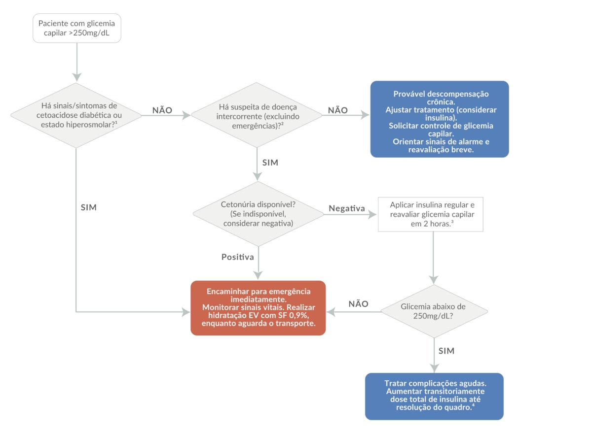
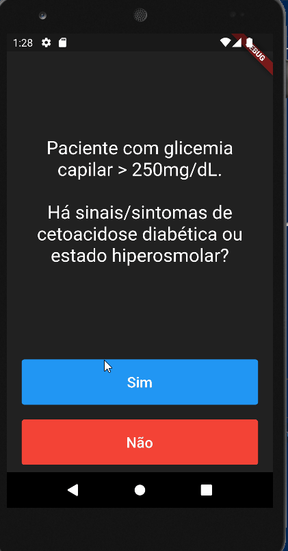

# Apoio a paciente com diabetes

Você deve construir um aplicativo _mobile_ para auxiliar médicos
do pronto-socorro que precisam atender pacientes com diabetes.
O fluxograma a seguir foi encaminhado para você:

Um esqueleto do aplicativo é fornecido junto a este repositório. O leiaute também foi fornecido. Mas você deve terminar o aplicativo, implementando as funcionalidades necessárias para que ele funcione corretamente.

## Aplicativo em funcionamento

O aplicativo deve funcionar conforme o vídeo a seguir:

